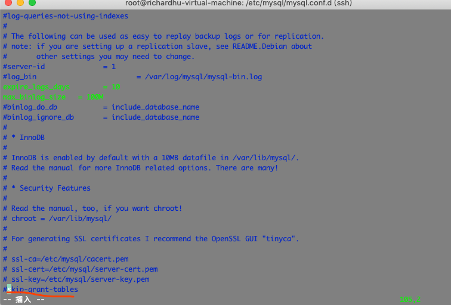

[TOC]


```

(bbs-env) root@richardhu-virtual-machine:/srv/bbs# ls
 app.py exts.py PEP8_notes.txt README.md static utils
 apps manage.py __pycache__ requirements.txt tasks.py
 config.py migrations README.en.md 'some points.txt' templates
(bbs-env) root@richardhu-virtual-machine:/srv/bbs# pip install -r requirements.txt
Collecting alembic==1.3.1
  Downloading https://files.pythonhosted.org/packages/84/64/493c45119dce700a4b9eeecc436ef9e8835ab67bae6414f040cdc7b58f4b/alembic-1.3.1.tar.gz (1.1MB)
     |████████████████████████████████| 1.1MB 24.9MB/s
Collecting amqp==2.5.2
  Downloading https://files.pythonhosted.org/packages/fc/a0/6aa2a7923d4e82dda23db27711d565f0c4abf1570859f168e3d0975f1eb6/amqp-2.5.2-py2.py3-none-any.whl (49kB)
     |████████████████████████████████| 51kB 3.0MB/s
Collecting aniso8601==8.0.0
  Downloading https://files.pythonhosted.org/packages/eb/e4/787e104b58eadc1a710738d4e418d7e599e4e778e52cb8e5d5ef6ddd5833/aniso8601-8.0.0-py2.py3-none-any.whl (43kB)
     |████████████████████████████████| 51kB 673kB/s
Collecting billiard==3.6.1.0
  Downloading https://files.pythonhosted.org/packages/9a/bb/2a016ac912fca48e06ff5a662407f3d1681aa47df97fb19feba7cc931ee1/billiard-3.6.1.0-py3-none-any.whl (89kB)
     |████████████████████████████████| 92kB 2.4MB/s
Collecting blinker==1.4
  Downloading https://files.pythonhosted.org/packages/1b/51/e2a9f3b757eb802f61dc1f2b09c8c99f6eb01cf06416c0671253536517b6/blinker-1.4.tar.gz (111kB)
     |████████████████████████████████| 112kB 421kB/s
Collecting celery==4.4.0
  Downloading https://files.pythonhosted.org/packages/47/53/6e2ccc87b18ddc582d2de31b3ed9144c72a68062659e9e4a68e19312d254/celery-4.4.0-py2.py3-none-any.whl (421kB)
     |████████████████████████████████| 430kB 1.5MB/s
Collecting certifi==2019.11.28
  Downloading https://files.pythonhosted.org/packages/b9/63/df50cac98ea0d5b006c55a399c3bf1db9da7b5a24de7890bc9cfd5dd9e99/certifi-2019.11.28-py2.py3-none-any.whl (156kB)
     |████████████████████████████████| 163kB 287kB/s
Collecting chardet==3.0.4
  Downloading https://files.pythonhosted.org/packages/bc/a9/01ffebfb562e4274b6487b4bb1ddec7ca55ec7510b22e4c51f14098443b8/chardet-3.0.4-py2.py3-none-any.whl (133kB)
     |████████████████████████████████| 143kB 293kB/s
Collecting Click==7.0
  Downloading https://files.pythonhosted.org/packages/fa/37/45185cb5abbc30d7257104c434fe0b07e5a195a6847506c074527aa599ec/Click-7.0-py2.py3-none-any.whl (81kB)
     |████████████████████████████████| 81kB 443kB/s
Collecting Flask==1.1.1
  Downloading https://files.pythonhosted.org/packages/9b/93/628509b8d5dc749656a9641f4caf13540e2cdec85276964ff8f43bbb1d3b/Flask-1.1.1-py2.py3-none-any.whl (94kB)
     |████████████████████████████████| 102kB 128kB/s
Collecting Flask-Mail==0.9.1
  Downloading https://files.pythonhosted.org/packages/05/2f/6a545452040c2556559779db87148d2a85e78a26f90326647b51dc5e81e9/Flask-Mail-0.9.1.tar.gz (45kB)
     |████████████████████████████████| 51kB 268kB/s
Collecting Flask-Migrate==2.5.2
  Downloading https://files.pythonhosted.org/packages/4b/22/d20a105f13c58fe590ef38ac59d5cabc1a917549ea8f90b0ca7b4e84f6be/Flask_Migrate-2.5.2-py2.py3-none-any.whl
Collecting flask-paginate==0.5.5
  Downloading https://files.pythonhosted.org/packages/a2/5a/133899485b67440d0bddbead5f90191f9bbb3c60b600dbddd184f85c2c1a/flask_paginate-0.5.5-py2.py3-none-any.whl
Collecting Flask-RESTful==0.3.7
  Downloading https://files.pythonhosted.org/packages/17/44/6e490150ee443ca81d5f88b61bb4bbb133d44d75b0b716ebe92489508da4/Flask_RESTful-0.3.7-py2.py3-none-any.whl
Collecting Flask-Script==2.0.6
  Downloading https://files.pythonhosted.org/packages/00/a4/cd587b2b19f043b65bf33ceda2f6e4e6cdbd0ce18d01a52b9559781b1da6/Flask-Script-2.0.6.tar.gz (43kB)
     |████████████████████████████████| 51kB 152kB/s
Collecting Flask-SQLAlchemy==2.4.1
  Downloading https://files.pythonhosted.org/packages/1e/65/226d95466c75e34e291a76890ed0e27af2e46ab913002847856f11d4d59d/Flask_SQLAlchemy-2.4.1-py2.py3-none-any.whl
Collecting Flask-WTF==0.14.2
  Downloading https://files.pythonhosted.org/packages/60/3a/58c629472d10539ae5167dc7c1fecfa95dd7d0b7864623931e3776438a24/Flask_WTF-0.14.2-py2.py3-none-any.whl
Collecting idna==2.8
  Downloading https://files.pythonhosted.org/packages/14/2c/cd551d81dbe15200be1cf41cd03869a46fe7226e7450af7a6545bfc474c9/idna-2.8-py2.py3-none-any.whl (58kB)
     |████████████████████████████████| 61kB 199kB/s
Collecting importlib-metadata==1.3.0
  Downloading https://files.pythonhosted.org/packages/e9/71/1a1e0ed0981bb6a67bce55a210f168126b7ebd2065958673797ea66489ca/importlib_metadata-1.3.0-py2.py3-none-any.whl
Collecting itsdangerous==1.1.0
  Downloading https://files.pythonhosted.org/packages/76/ae/44b03b253d6fade317f32c24d100b3b35c2239807046a4c953c7b89fa49e/itsdangerous-1.1.0-py2.py3-none-any.whl
Collecting Jinja2==2.10.3
  Downloading https://files.pythonhosted.org/packages/65/e0/eb35e762802015cab1ccee04e8a277b03f1d8e53da3ec3106882ec42558b/Jinja2-2.10.3-py2.py3-none-any.whl (125kB)
     |████████████████████████████████| 133kB 90kB/s
Collecting kombu==4.6.7
  Downloading https://files.pythonhosted.org/packages/96/94/b899b1d962f6b9ca0171a4796ca086c9785f0cc0b7705562e0a70d144910/kombu-4.6.7-py2.py3-none-any.whl (182kB)
     |████████████████████████████████| 184kB 51kB/s
Collecting Mako==1.1.0
  Downloading https://files.pythonhosted.org/packages/b0/3c/8dcd6883d009f7cae0f3157fb53e9afb05a0d3d33b3db1268ec2e6f4a56b/Mako-1.1.0.tar.gz (463kB)
     |████████████████████████████████| 471kB 26kB/s
Collecting MarkupSafe==1.1.1
  Downloading https://files.pythonhosted.org/packages/b2/5f/23e0023be6bb885d00ffbefad2942bc51a620328ee910f64abe5a8d18dd1/MarkupSafe-1.1.1-cp36-cp36m-manylinux1_x86_64.whl
Collecting more-itertools==8.0.2
  Downloading https://files.pythonhosted.org/packages/68/03/0604cec1ea13c9f063dd50f900d1a36160334dd3cfb01fd0e638f61b46ba/more_itertools-8.0.2-py3-none-any.whl (40kB)
     |████████████████████████████████| 40kB 129kB/s
Collecting Pillow==6.2.1
  Downloading https://files.pythonhosted.org/packages/10/5c/0e94e689de2476c4c5e644a3bd223a1c1b9e2bdb7c510191750be74fa786/Pillow-6.2.1-cp36-cp36m-manylinux1_x86_64.whl (2.1MB)
     |████████████████████████████████| 2.1MB 98kB/s
Collecting PyMySQL==0.9.3
  Downloading https://files.pythonhosted.org/packages/ed/39/15045ae46f2a123019aa968dfcba0396c161c20f855f11dea6796bcaae95/PyMySQL-0.9.3-py2.py3-none-any.whl (47kB)
     |████████████████████████████████| 51kB 100kB/s
Collecting python-dateutil==2.8.1
  Downloading https://files.pythonhosted.org/packages/d4/70/d60450c3dd48ef87586924207ae8907090de0b306af2bce5d134d78615cb/python_dateutil-2.8.1-py2.py3-none-any.whl (227kB)
     |████████████████████████████████| 235kB 87kB/s
Collecting python-editor==1.0.4
  Downloading https://files.pythonhosted.org/packages/c6/d3/201fc3abe391bbae6606e6f1d598c15d367033332bd54352b12f35513717/python_editor-1.0.4-py3-none-any.whl
Collecting python-memcached==1.59
  Downloading https://files.pythonhosted.org/packages/f5/90/19d3908048f70c120ec66a39e61b92c253e834e6e895cd104ce5e46cbe53/python_memcached-1.59-py2.py3-none-any.whl
Collecting pytz==2019.3
  Downloading https://files.pythonhosted.org/packages/e7/f9/f0b53f88060247251bf481fa6ea62cd0d25bf1b11a87888e53ce5b7c8ad2/pytz-2019.3-py2.py3-none-any.whl (509kB)
     |████████████████████████████████| 512kB 33kB/s
Collecting qiniu==7.2.6
  Downloading https://files.pythonhosted.org/packages/0c/43/069ab7f8ebca63b17641622886cd3b806fa1e2f65fa8538e0ff0f303be2d/qiniu-7.2.6.tar.gz
Collecting redis==3.3.11
  Downloading https://files.pythonhosted.org/packages/32/ae/28613a62eea0d53d3db3147f8715f90da07667e99baeedf1010eb400f8c0/redis-3.3.11-py2.py3-none-any.whl (66kB)
     |████████████████████████████████| 71kB 44kB/s
Collecting requests==2.22.0
  Downloading https://files.pythonhosted.org/packages/51/bd/23c926cd341ea6b7dd0b2a00aba99ae0f828be89d72b2190f27c11d4b7fb/requests-2.22.0-py2.py3-none-any.whl (57kB)
     |████████████████████████████████| 61kB 92kB/s
Collecting shortuuid==0.5.0
  Downloading https://files.pythonhosted.org/packages/80/d7/2bfc9332e68d3e15ea97b9b1588b3899ad565120253d3fd71c8f7f13b4fe/shortuuid-0.5.0.tar.gz
Collecting six==1.13.0
  Downloading https://files.pythonhosted.org/packages/65/26/32b8464df2a97e6dd1b656ed26b2c194606c16fe163c695a992b36c11cdf/six-1.13.0-py2.py3-none-any.whl
Collecting SQLAlchemy==1.3.11
  Downloading https://files.pythonhosted.org/packages/34/5c/0e1d7ad0ca52544bb12f9cb8d5cc454af45821c92160ffedd38db0a317f6/SQLAlchemy-1.3.11.tar.gz (6.0MB)
     |████████████████████████████████| 6.0MB 63kB/s
Collecting urllib3==1.25.7
  Downloading https://files.pythonhosted.org/packages/b4/40/a9837291310ee1ccc242ceb6ebfd9eb21539649f193a7c8c86ba15b98539/urllib3-1.25.7-py2.py3-none-any.whl (125kB)
     |████████████████████████████████| 133kB 33kB/s
Collecting vine==1.3.0
  Downloading https://files.pythonhosted.org/packages/7f/60/82c03047396126c8331ceb64da1dc52d4f1317209f32e8fe286d0c07365a/vine-1.3.0-py2.py3-none-any.whl
Collecting Werkzeug==0.16.0
  Downloading https://files.pythonhosted.org/packages/ce/42/3aeda98f96e85fd26180534d36570e4d18108d62ae36f87694b476b83d6f/Werkzeug-0.16.0-py2.py3-none-any.whl (327kB)
     |████████████████████████████████| 327kB 31kB/s
Collecting wtf==0.1
  Downloading https://files.pythonhosted.org/packages/41/a6/ebdb36bf9caefdf96f1b2382ae1bfc5b1d32d3b404a7cdffb5d5a24f84f5/wtf-0.1.tar.gz
Collecting WTForms==2.2.1
  Downloading https://files.pythonhosted.org/packages/9f/c8/dac5dce9908df1d9d48ec0e26e2a250839fa36ea2c602cc4f85ccfeb5c65/WTForms-2.2.1-py2.py3-none-any.whl (166kB)
     |████████████████████████████████| 174kB 21kB/s
Collecting zipp==0.6.0
  Downloading https://files.pythonhosted.org/packages/74/3d/1ee25a26411ba0401b43c6376d2316a71addcc72ef8690b101b4ea56d76a/zipp-0.6.0-py2.py3-none-any.whl
Building wheels for collected packages: alembic, blinker, Flask-Mail, Flask-Script, Mako, qiniu, shortuuid, SQLAlchemy, wtf
  Building wheel for alembic (setup.py) ... done
  Created wheel for alembic: filename=alembic-1.3.1-py2.py3-none-any.whl size=144523 sha256=c932aea373489013f18468b00022651d0f6a103b20e17b7993985380e9be80c2
  Stored in directory: /root/.cache/pip/wheels/b2/d4/19/5ab879d30af7cbc79e6dcc1d421795b1aa9d78f455b0412ef7
  Building wheel for blinker (setup.py) ... done
  Created wheel for blinker: filename=blinker-1.4-cp36-none-any.whl size=13449 sha256=e3d65e754c6e342f5e3285e51f00641c2209875d869be6b8a42503eeedf1012b
  Stored in directory: /root/.cache/pip/wheels/92/a0/00/8690a57883956a301d91cf4ec999cc0b258b01e3f548f86e89
  Building wheel for Flask-Mail (setup.py) ... done
  Created wheel for Flask-Mail: filename=Flask_Mail-0.9.1-cp36-none-any.whl size=7569 sha256=f9bd89f0cae20735b99e2b1c335c9db32f0334439d59e1c90a49ba5f3657b84b
  Stored in directory: /root/.cache/pip/wheels/eb/aa/d9/34b8f2f9bce7d06a4d07fd46078770584d5504949ebfa286f5
  Building wheel for Flask-Script (setup.py) ... done
  Created wheel for Flask-Script: filename=Flask_Script-2.0.6-cp36-none-any.whl size=14016 sha256=6b37aee8dcce6d46987d838f5b6ff35526fcb9cbd5b27cda814a407871439d6f
  Stored in directory: /root/.cache/pip/wheels/1c/17/70/4598e6dba4bec58c1b59552c6409272aea31978ab8159f11a1
  Building wheel for Mako (setup.py) ... done
  Created wheel for Mako: filename=Mako-1.1.0-cp36-none-any.whl size=75363 sha256=9176f9c7ba041e7bb7ae4473391fcabe4f23fed843830b92a0115e1ffba0164f
  Stored in directory: /root/.cache/pip/wheels/98/32/7b/a291926643fc1d1e02593e0d9e247c5a866a366b8343b7aa27
  Building wheel for qiniu (setup.py) ... done
  Created wheel for qiniu: filename=qiniu-7.2.6-cp36-none-any.whl size=33362 sha256=e857bc8d3c700cb1b809d7535ec2f4dedde11f3b05fbe94d8ed56d4dad93b956
  Stored in directory: /root/.cache/pip/wheels/6a/01/74/3fd424d2f70e31575d66f04821947fbce638833a29920631bb
  Building wheel for shortuuid (setup.py) ... done
  Created wheel for shortuuid: filename=shortuuid-0.5.0-cp36-none-any.whl size=5499 sha256=1f3c47a733aa6f0bb7c94216785525e8481395d756d7229283d01017ba22e8f8
  Stored in directory: /root/.cache/pip/wheels/3f/eb/fd/69e5177f67b505e44acbd1aedfbe44b91768ee0c4cd5636576
  Building wheel for SQLAlchemy (setup.py) ... done
  Created wheel for SQLAlchemy: filename=SQLAlchemy-1.3.11-cp36-cp36m-linux_x86_64.whl size=1210344 sha256=d2dcd8a928e60acdec40fa766c039093635467bfaa0f8b2aa6c8de6c8b0045ce
  Stored in directory: /root/.cache/pip/wheels/a3/67/7d/6c41104a1a08ff1a25e260d3edec3ac19203141d1aaa2f0975
  Building wheel for wtf (setup.py) ... done
  Created wheel for wtf: filename=wtf-0.1-cp36-none-any.whl size=3652 sha256=70de9b6a0a53c528498dba59cb3cb56ce28fb2bae91dd6f620221612bd4952b4
  Stored in directory: /root/.cache/pip/wheels/2d/5d/6d/355f9d42f801debc91bc18f9592406a1e26e047225665bf68d
Successfully built alembic blinker Flask-Mail Flask-Script Mako qiniu shortuuid SQLAlchemy wtf
Installing collected packages: SQLAlchemy, MarkupSafe, Mako, python-editor, six, python-dateutil, alembic, vine, amqp, aniso8601, billiard, blinker, more-itertools, zipp, importlib-metadata, kombu, pytz, celery, certifi, chardet, Click, itsdangerous, Jinja2, Werkzeug, Flask, Flask-Mail, Flask-SQLAlchemy, Flask-Migrate, flask-paginate, Flask-RESTful, Flask-Script, WTForms, Flask-WTF, idna, Pillow, PyMySQL, python-memcached, urllib3, requests, qiniu, redis, shortuuid, wtf
Successfully installed Click-7.0 Flask-1.1.1 Flask-Mail-0.9.1 Flask-Migrate-2.5.2 Flask-RESTful-0.3.7 Flask-SQLAlchemy-2.4.1 Flask-Script-2.0.6 Flask-WTF-0.14.2 Jinja2-2.10.3 Mako-1.1.0 MarkupSafe-1.1.1 Pillow-6.2.1 PyMySQL-0.9.3 SQLAlchemy-1.3.11 WTForms-2.2.1 Werkzeug-0.16.0 alembic-1.3.1 amqp-2.5.2 aniso8601-8.0.0 billiard-3.6.1.0 blinker-1.4 celery-4.4.0 certifi-2019.11.28 chardet-3.0.4 flask-paginate-0.5.5 idna-2.8 importlib-metadata-1.3.0 itsdangerous-1.1.0 kombu-4.6.7 more-itertools-8.0.2 python-dateutil-2.8.1 python-editor-1.0.4 python-memcached-1.59 pytz-2019.3 qiniu-7.2.6 redis-3.3.11 requests-2.22.0 shortuuid-0.5.0 six-1.13.0 urllib3-1.25.7 vine-1.3.0 wtf-0.1 zipp-0.6.0

```
## 一些问题及其解决(主要是端口占用问题)
```
(bbs-env) root@richardhu-virtual-machine:/srv/mybbs# lsof -i :5000
(bbs-env) root@richardhu-virtual-machine:/srv/mybbs# python app.py
 * Serving Flask app "app" (lazy loading)
 * Environment: production
   WARNING: This is a development server. Do not use it in a production deployment.
   Use a production WSGI server instead.
 * Debug mode: on
 * Running on http://127.0.0.1:5000/ (Press CTRL+C to quit)
 * Restarting with stat
 * Debugger is active!
 * Debugger PIN: 286-328-502
^Z


(bbs-env) root@richardhu-virtual-machine:/srv/mybbs# lsof -i :5000
COMMAND PID USER FD TYPE DEVICE SIZE/OFF NODE NAME
python 20323 root 3u IPv4 162851 0t0 TCP ip6-localhost:5000 (LISTEN)
python 20327 root 3u IPv4 162851 0t0 TCP ip6-localhost:5000 (LISTEN)
python 20327 root 4u IPv4 162851 0t0 TCP ip6-localhost:5000 (LISTEN)
(bbs-env) root@richardhu-virtual-machine:/srv/mybbs# kill -9 20323
(bbs-env) root@richardhu-virtual-machine:/srv/mybbs# lsof -i :5000
[5]+ 已杀死 python app.py
(bbs-env) root@richardhu-virtual-machine:/srv/mybbs# lsof -i :5000
```


## ubuntu下mysql登陆问题
```
root@richardhu-virtual-machine:/etc/mysql# mysql
ERROR 1045 (28000): Access denied for user 'root'@'localhost' (using password: NO)

```

解决:
```
root@richardhu-virtual-machine:/etc/mysql# cd mysql.conf.d
root@richardhu-virtual-machine:/etc/mysql/mysql.conf.d# ls
mysqld.cnf mysqld_safe_syslog.cnf
root@richardhu-virtual-machine:/etc/mysql/mysql.conf.d# vim mysqld.cnf

```

找到mysql的安装目录，我的是在/etc/mysql/mysql.conf.d ，该文件夹下有个mysqld.cnf文件(注意路径`/etc/mysql/mysql.conf.d`)，使用管理员权限编辑：sudo vim mysqld.cnf，然后在文件最后一行加入：skip-grant-tables ，然后保存退出（大概就是跳过验证的意思吧）
然后需要重启mysql服务，重启命令有好几种，反正适合我的命令是：sudo systemctl restart mysql.service。

接下来用空密码进入mysql管理命令行，切换到mysql库，直接命令：mysql 回车即可进入mysql命令模式，然后就是修改下root密码（其他用户也一样，只是权限不一样），修改密码语句如下：
```

mysql> update mysql.user set authentication_string=password('newpass') where user='root' and Host ='localhost';
Query OK, 1 row affected, 1 warning (2.47 sec)
Rows matched: 1 Changed: 1 Warnings: 1

mysql> flush privileges;
Query OK, 0 rows affected (0.09 sec)

mysql> exit
Bye

```



 下一步便是把刚才我们改的mysqld.cnf文件，把刚才加入的那一行注释或者删除：skip-grant-tables ，保存退出。
我自己这里没删，因为发现删了之后又会出现上面那个错误
### 这里有解决办法


```
root@richardhu-virtual-machine:/etc/mysql/mysql.conf.d# mysql
ERROR 1045 (28000): Access denied for user 'root'@'localhost' (using password: NO)
root@richardhu-virtual-machine:/etc/mysql/mysql.conf.d# mysql -u root -p
Enter password:
ERROR 1045 (28000): Access denied for user 'root'@'localhost' (using password: YES)
root@richardhu-virtual-machine:/etc/mysql/mysql.conf.d# vim mysqld.cnf


root@richardhu-virtual-machine:/etc/mysql/mysql.conf.d# mysql
ERROR 1045 (28000): Access denied for user 'root'@'localhost' (using password: NO)
root@richardhu-virtual-machine:/etc/mysql/mysql.conf.d# systemctl restart mysql.service
root@richardhu-virtual-machine:/etc/mysql/mysql.conf.d# mysql
Welcome to the MySQL monitor. Commands end with ; or \g.

```


## unknown databases问题
```

mysql> show databases;
+--------------------+
| Database |
+--------------------+
| information_schema |
| mysql |
| performance_schema |
| sys |
+--------------------+
4 rows in set (0.98 sec)

mysql> create database zlbbs charset utf8;
Query OK, 1 row affected (0.35 sec)

mysql> show databases;
+--------------------+
| Database |
+--------------------+
| information_schema |
| mysql |
| performance_schema |
| sys |
| zlbbs |
+--------------------+
5 rows in set (0.01 sec)
```

注意此时还需要把数据库迁移过来
```
(bbs-env) root@richardhu-virtual-machine:/srv/mybbs# python manage.py db upgrade
INFO [alembic.runtime.migration] Context impl MySQLImpl.
INFO [alembic.runtime.migration] Will assume non-transactional DDL.
INFO [alembic.runtime.migration] Running upgrade -> 6f5a8c020ab4, empty message
INFO [alembic.runtime.migration] Running upgrade 6f5a8c020ab4 -> 08504da615b9, empty message
INFO [alembic.runtime.migration] Running upgrade 08504da615b9 -> 725375213f6e, empty message
INFO [alembic.runtime.migration] Running upgrade 725375213f6e -> d002dfa15693, empty message
INFO [alembic.runtime.migration] Running upgrade d002dfa15693 -> bcd1ceec0210, empty message
INFO [alembic.runtime.migration] Running upgrade bcd1ceec0210 -> f9d6a44c9f5d, empty message
INFO [alembic.runtime.migration] Running upgrade f9d6a44c9f5d -> 5deacd3d34d0, empty message
INFO [alembic.runtime.migration] Running upgrade 5deacd3d34d0 -> c5b238cda56e, empty message
INFO [alembic.runtime.migration] Running upgrade c5b238cda56e -> 6d63cee9a614, empty message
INFO [alembic.runtime.migration] Running upgrade 6d63cee9a614 -> b0eb726981df, empty message


mysql> show databases;
+--------------------+
| Database |
+--------------------+
| information_schema |
| mysql |
| performance_schema |
| sys |
| zlbbs |
+--------------------+
5 rows in set (0.01 sec)

mysql> show tables;
ERROR 1046 (3D000): No database selected
mysql> use zlbbs;
Reading table information for completion of table and column names
You can turn off this feature to get a quicker startup with -A

Database changed
mysql> show tables;
+-----------------+
| Tables_in_zlbbs |
+-----------------+
| alembic_version |
| banner |
| board |
| cms_role |
| cms_role_user |
| cms_user |
| comment |
| front_user |
| highlight_post |
| post |
+-----------------+
10 rows in set (0.01 sec)
```


